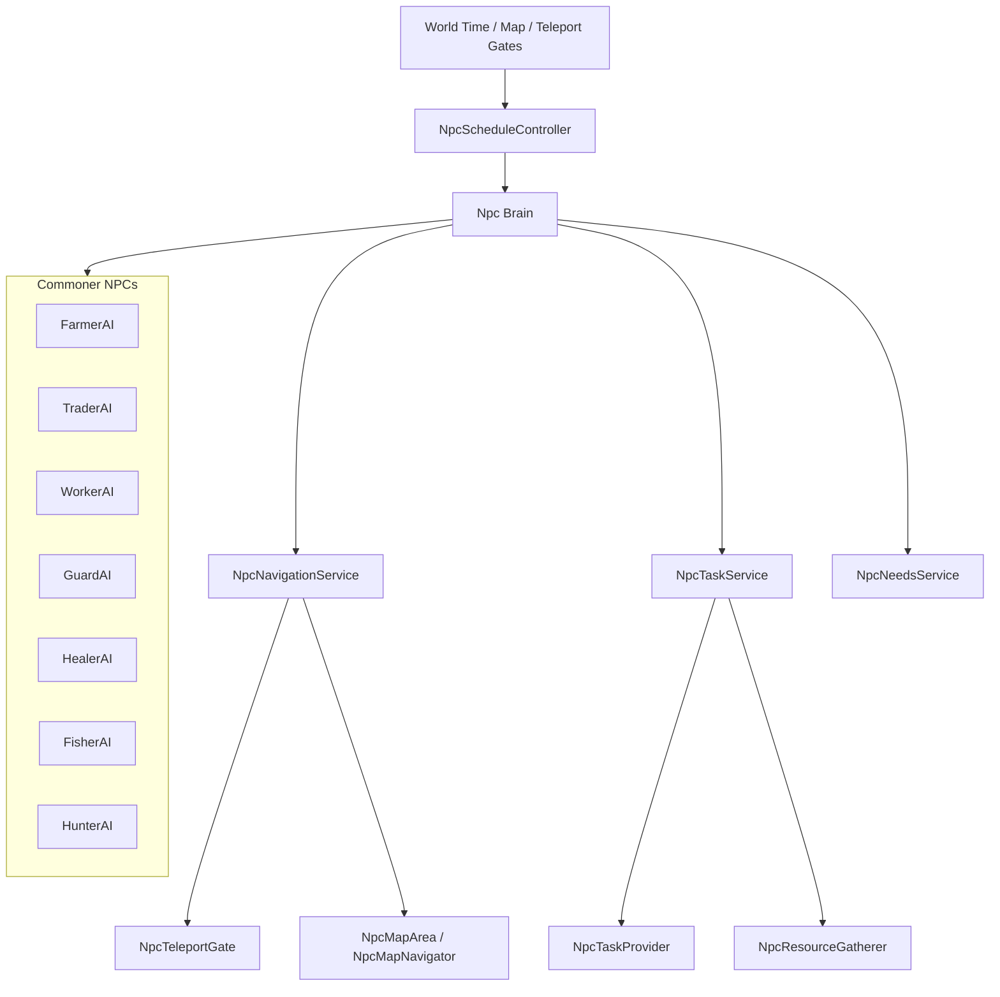

# NPC Architecture

Mục tiêu của bản tách này là đưa mỗi loại NPC về đúng vai trò riêng, giảm tình trạng `VillagerAI` và `NpcTaskProvider` ôm quá nhiều luật cùng lúc.

## Mục tiêu thiết kế

- Mỗi NPC chỉ có một `brain` chính.
- Lịch ngày tách theo `job` hoặc `life path`.
- Điều hướng teleport là một service riêng, không lẫn vào task logic.
- Task provider chỉ cấp nhiệm vụ, không điều khiển toàn bộ AI.
- `VillagerAI` không còn là nơi chứa mọi luật nghề nghiệp.

## Sơ đồ tổng quan

## Trạng thái hiện tại

### Lớp đang phình to

- [`VillagerAI.cs`](../Assets/Scripts/VillagerAI.cs)
- [`NpcTaskProvider.cs`](../Assets/Scripts/NpcTaskProvider.cs)

### Lớp nền tốt để giữ lại

- [`NpcScheduleController.cs`](../Assets/Scripts/NpcScheduleController.cs)
- [`NpcMapNavigator.cs`](../Assets/Scripts/NpcMapNavigator.cs)
- [`NpcTeleportGate.cs`](../Assets/Scripts/NpcTeleportGate.cs)
- [`NpcMapMover2D.cs`](../Assets/Scripts/NpcMapMover2D.cs)
- [`NpcResourceGatherer.cs`](../Assets/Scripts/NpcResourceGatherer.cs)

## Phân vai đích

### 1. `NpcScheduleController`

Chỉ làm 3 việc:

- Giữ slot lịch.
- Trả lời “bây giờ đang ở activity nào”.
- Build lịch mặc định từ một library cấu hình riêng.

Không nên:

- Quyết định chi tiết nông dân sáng làm gì, trưa làm gì.
- Ôm logic nghề nghiệp.

### 2. `NpcDailyRoutineLibrary`

Đây là nơi định nghĩa lịch theo loại NPC.

Ví dụ:

- Farmer
- Trader
- Worker
- Guard
- Healer
- Fisher
- Hunter
- Cultivator

Mỗi loại có thể có nhiều biến thể ngẫu nhiên, nhưng vẫn phải nằm trong một bảng riêng.

### 3. `NpcBrain` theo job

Mỗi loại NPC nên có brain riêng hoặc ít nhất là một lớp con/strategy riêng:

- `FarmerBrain`
- `TraderBrain`
- `WorkerBrain`
- `GuardBrain`
- `HealerBrain`
- `FisherBrain`
- `HunterBrain`

Brain chỉ nên quyết định:

- hiện tại đi đâu
- làm gì
- có nên đổi trạng thái hay không
- khi nào nhường cho schedule

Brain không nên:

- tự xử route teleport
- tự bán hàng
- tự nhặt vật phẩm
- tự build lịch

### 4. `NpcNavigationService`

Chỉ lo:

- chọn điểm đích hợp lệ
- route qua cổng dịch chuyển
- fallback khi target nằm sát biên map
- resolve zone của mục tiêu

Các lớp liên quan:

- [`NpcMapNavigator.cs`](../Assets/Scripts/NpcMapNavigator.cs)
- [`NpcTeleportGate.cs`](../Assets/Scripts/NpcTeleportGate.cs)
- [`NpcMapArea.cs`](../Assets/Scripts/NpcMapArea.cs)

### 5. `NpcTaskService`

Chỉ lo:

- nhận task
- trả task
- xử lý offer
- giữ trạng thái task đang chạy

`NpcTaskProvider` nên là provider thuần:

- cấp offer
- nhận visitor
- khởi tạo request

Không nên:

- quyết định toàn bộ hành vi ngày của NPC
- tự điều hướng NPC
- ôm cả lịch và cả đi lại

### 6. `NpcNeedsService`

Chỉ lo:

- đói
- mệt
- vui
- cần nghỉ
- cần ăn

Brain sẽ đọc trạng thái này rồi quyết định hành động.

## Lịch mẫu cho nông dân

Đây là lịch đích để làm mẫu trước.

### Khung chuẩn

- 05:00 - 06:00: ăn, chuẩn bị ngày mới
- 06:00 - 10:00: làm ruộng
- 10:00 - 11:00: nghỉ / ăn
- 11:00 - 15:00: làm ruộng hoặc thu hoạch
- 15:00 - 17:00: bán nông sản / giao hàng
- 17:00 - 21:00: về nhà / đi lại nhẹ
- 21:00 - 05:00: ngủ

### Tỷ lệ biến thể

- 65%: ngày làm ruộng chuẩn
- 20%: sáng làm ruộng, trưa bán hàng
- 10%: xen nhiệm vụ phụ
- 5%: ngày nhẹ, giảm di chuyển

## Cách tách code

### Giai đoạn 1

- Giữ `NpcScheduleController`.
- Tách lịch sang `NpcDailyRoutineLibrary`.
- Chỉ cho `NpcScheduleController` gọi vào library.

### Giai đoạn 2

- Tách `VillagerAI` thành nhiều brain theo job.
- Đưa từng job sang file riêng.
- Giữ một lớp base chung nếu cần.

### Giai đoạn 3

- Rút `NpcTaskProvider` về vai trò provider.
- Rút route/teleport ra khỏi task logic.

### Giai đoạn 4

- Tách `NpcResourceGatherer` thành component thuần gather.
- Không để nó tự hiểu quá nhiều về schedule nếu không cần.

## Ưu tiên làm tiếp

1. `FarmerAI`
2. `TraderAI`
3. `WorkerAI`
4. `GuardAI`
5. `FisherAI`
6. `HunterAI`

## Nguyên tắc giữ cho hệ thống không bị rối lại

- Một lớp chỉ nên có một lý do để thay đổi.
- Lịch không quyết định pathing.
- Task không quyết định nhu cầu sống.
- Brain không quyết định map rules.
- Teleport không quyết định behavior.

